  

  <a href="https://prajwal2308.github.io"><b>Portfolio</b></a> &nbsp;·&nbsp;
  <a href="https://linkedin.com/in/prajwalsrinivas238">LinkedIn</a> &nbsp;·&nbsp;
  <a href="mailto:prajwal.srinivas238@gmail.com">prajwal.srinivas238@gmail.com</a>

 

<table>
<tr>
<td width="50%" valign="top">

### How I work

I don't have a favourite layer of the stack. Given a problem I'll take it end to end — a desktop app, a distributed backend, an inference gateway, a research prototype — and the five projects below are deliberately five *different kinds of thing*, not five versions of one.

What carries across all of them is the same habit: make the invisible legible first — telemetry, traces, cost, an audit log you can verify — and only then optimise. Redis went in front of Mongo because the traces said session reads were the bottleneck, not because caching is good practice.

</td>
<td width="50%" valign="top">

### What that's produced

I ship the whole thing: Terraform and a Helm chart, not a notebook. **Claude Code** is in the loop daily — enough that I built a governance layer for agentic coding tools and have opinions about where they need supervision.

|  |  |
|---|---|
| **99.9%** | uptime · 1k+ users, AWS + GCP |
| **4.2×** | orchestration speedup, measured |
| **95%** | test coverage in a 4-week contract |
| **1st** | AESIA × UN Tech Over Hackathon |

</td>
</tr>
</table>

---

## Selected work

<table>
<tr><td width="172" valign="top"><b>LLMOps Control Plane</b> Aug 2026 · live  <code>FastAPI</code> <code>Kubernetes</code> <code>Helm</code> <code>Terraform</code> <code>OpenTelemetry</code></td>
<td valign="top">A self-hostable gateway to OpenAI, Anthropic, Gemini, Bedrock, Fireworks and xAI behind one <b>OpenAI-compatible API</b> — adoption is a base-URL change, not a rewrite. Complexity-based routing sends cheap prompts to cheap models; when a provider errors, an automatic failover chain walks the tiers so the client sees one slightly slower success instead of a 500. Prompt-injection defense inbound, PII redaction outbound, per-request latency/token/cost telemetry on a live SSE dashboard.  
<a href="https://llmops-control-plane.onrender.com"><b>Live dashboard</b></a> · <a href="https://github.com/prajwal2308/LLMOps-Control-Plane">Source</a></td></tr>

<tr><td valign="top"><b>VACS</b> Aug 2026 · shipped  <code>Swift</code> <code>SwiftUI</code> <code>macOS 14+</code></td>
<td valign="top">A disk cleaner for developers — the one audience for whom <i>"junk files"</i> is the wrong abstraction. Xcode DerivedData, the Docker VM disk, Ollama weights and Playwright browsers all look identical to a generic cleaner. VACS names all <b>96 audited paths</b> in plain English and gives the correct way to reclaim each, which is often <i>not</i> deleting the folder — for a live Docker VM it copies <code>docker system prune -a</code> rather than offering a delete button. Trash-only by default; nothing anywhere asks for <code>sudo</code>.  
<a href="https://prajwal2308.github.io/VACS/"><b>Website</b></a> · <a href="https://github.com/prajwal2308/VACS">Source</a> · <a href="https://github.com/prajwal2308/VACS/releases">Download</a></td></tr>

<tr><td valign="top"><b>SAGE</b> May 2026 · 1st place  <code>MCP</code> <code>TypeScript</code> <code>AI governance</code></td>
<td valign="top">Coding agents now write files, run shell commands and call APIs on their own. The industry's answer has mostly been a log you read afterwards — <b>and a log is not a control.</b> SAGE is an open-source governance harness for Claude Code, Cursor, OpenCode and Cline that evaluates what an agent is about to do <i>before</i> it happens. It hooks the Model Context Protocol boundary, the one place every tool call must pass through, so one integration covers all of them. Prompt-risk scoring, EU AI Act compliance path, cryptographic audit logs.  
<a href="https://www.npmjs.com/package/sage-governance"><b>npm</b></a> · <a href="https://github.com/Olustar/supervisory-agentic-governance-engine">Source</a></td></tr>

<tr><td valign="top"><b>Sawit</b> Aug 2026 · shipped  <code>FastAPI</code> <code>Whisper</code> <code>NVIDIA NIM</code> <code>RAG</code> <code>SQLite FTS5</code></td>
<td valign="top">Instagram's Saved folder is a wall of thumbnails — no search, no text, no way to ask <i>"what was that budget split?"</i> six months later. Share a reel to Sawit and about a minute later it's a searchable note with the steps, numbers and caveats extracted. The hard part: <b>most reels never say it out loud</b>, so audio transcription alone returns nothing — it reads the text off the frames with a 12-image multimodal pass, then indexes 2048-dim embeddings alongside SQLite FTS5 so a query needs to share <i>zero</i> words with the note it finds. Per-account isolation, 143 tests, MIT.  
<b>Finished, not maintained</b> — deployed for a month and it worked end to end, but the honest answer to <i>"would I open this every day?"</i> was no: people already look in Instagram's own Saved folder, and polish doesn't move a habit that isn't there. Public because the hard parts were worth writing down.  
<a href="https://github.com/prajwal2308/SAWIT">Source</a></td></tr>

<tr><td valign="top"><b>Hyper- Orchestrator</b> Apr 2026 · 4.2×  <code>Python</code> <code>AsyncIO</code> <code>DAG scheduling</code></td>
<td valign="top">Most agent workflows run one step at a time because that's the easy thing to write — even when four of the six steps have nothing to do with each other. A Planner Agent decomposes the goal and resolves the dependency DAG <i>before</i> any worker starts, then adaptive pools run independent branches simultaneously and a fusion pass merges the results. Deliberately single-file and dependency-light: the point was to understand the primitive, not wrap someone else's.  
<a href="https://github.com/prajwal2308/hyper-orchestrator">Source</a></td></tr>

<tr><td valign="top"><b>Thinker– Curator</b> Jan 2026 · research  <code>LangChain</code> <code>RAG</code> <code>PyTorch</code></td>
<td valign="top">A model only sees a limited window, and as a conversation grows things fall out of it — but the model doesn't know which of them mattered. Existing answers are either reactive (retrieve once asked) or naive (store everything). Here a <b>Thinker</b> proposes salient facts as the conversation happens and a <b>Curator</b> scores what gets admitted. Their disagreement is the mechanism, not a bug.  
<a href="https://github.com/prajwal2308/Proactive_Retrieval_Thinker_Curator_Model_for_AI_Memory">Source</a></td></tr>
</table>

<b>More on GitHub</b>

 

- **[Cloud Microservices Platform](https://github.com/prajwal2308/cloud-microservices-platform)** — Node gateway, Go auth and Python data services on EKS, provisioned end to end in Terraform with ALB, RDS replicas, ElastiCache, Prometheus and Grafana.
- **[Real-time AI Analytics](https://github.com/prajwal2308/realtime-ai-analytics)** — Streaming ingest with ML anomaly detection, WebSocket live feed, TimescaleDB persistence.
- **[LoRaWAN Mesh Simulator](https://github.com/prajwal2308/DIS_Final_Project_LoRAWAN)** — Four containerised multi-hop UDP mesh implementations benchmarked under fault injection.

---

## Experience

At **Beunec** I architected Beunec Cloud — a Next.js frontend and two distributed backend microservices across AWS and GCP — serving 1k+ users at 99.9% availability, with global load balancing and automated multi-region failover via Cloudflare, and a Redis layer in front of MongoDB that removed a session-read bottleneck. I also built **Aselius AI**, a GenAI engine with integrated web search, end-to-end encryption and GDPR-compliant handling.

At **Universal Selfcare** I delivered a serverless GCP backend at 95% test coverage in four weeks, leading five developers to a 100% on-time MVP. At **Rutgers** I taught 200+ students web technologies and SQL. At **CSG** I shipped features for Customer Connect, the agent desktop used by global telecom carriers, cutting post-release defects 20%.

---

## Toolkit

| | |
|---|---|
| **Languages** | Python · TypeScript · JavaScript · Go · Swift · Java · SQL · Bash |
| **Cloud & DevOps** | AWS · GCP · Kubernetes (EKS/GKE) · Helm · Docker · Terraform · Cloudflare · GitHub Actions · CI/CD |
| **AI & data** | LangChain · MCP · RAG & vector search · PyTorch · OpenAI & Anthropic APIs · PostgreSQL · MongoDB · Redis · Kafka |
| **Product & frontend** | Next.js · React · Node/Express · FastAPI · Flask · SwiftUI · Tailwind · REST · gRPC |
| **Systems** | Distributed systems · system design · microservices · load balancing & failover · OpenTelemetry · Prometheus & Grafana |
| **Education** | **MS Computer Science**, Rutgers–New Brunswick, GPA 3.71/4.0 (2026) · **BE Computer Science**, MVJ College of Engineering, GPA 9.1/10 (2023) |

---

  <b>Open to software, platform, cloud/DevOps and AI engineering roles.</b> 
  United States · ready to relocate · F-1 OPT, STEM extension eligible  
  <a href="mailto:prajwal.srinivas238@gmail.com"><b>prajwal.srinivas238@gmail.com</b></a>

